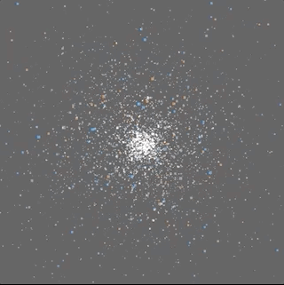

# nbody
A simple O(n^2) implementation of all-pairs nbody on CPU without optimizations


# Quick start:
```
$ make
```

## command-line test
```
$ ./nbody
```

## OpenGL version (GLFW) - TODO: modify make to run on Linux
```
$ ./nbody_gl
```
